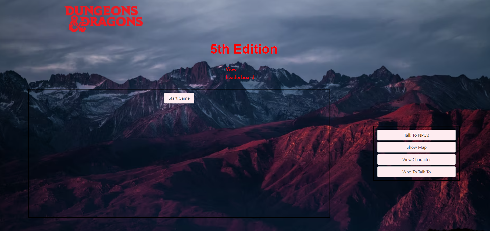

# dnd-5e-the-adventure
Project 1 for MSU Coding BootCamp

## How to use
1. Open this link: [Github Pages Link](https://quentinhnilica.github.io/dnd-5e-the-adventure/)
2. Press start game and create your character.
3. After learning about the game, enter the dungeon using the "Show Map" Button
4. Battle through the dungeon until you have died.
5. Each Death will grant you a buff you can get from an NPC in game.
6. Continue this process until you beat the 5th floor boss. 

## Design 
- Used Bulma for styling the page.

## Features
- Once the game is beaten, you can save your score (Amount of deaths until winning) using local Storage
- Full responsive UI
- Joke telling API (Used when talking to an NPC)
- DND 5E API (gets info from the offical books for character creation)

## Languages Used
- JavaScript (Logic)
- HTML (Bones of site)
- Bulma (Styling)
- Css (For minor Tweeks)
- Json (For NPC Dialog)
